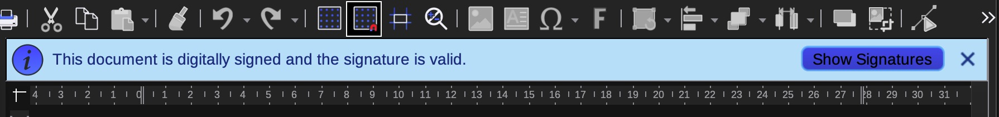

# KOREAN digital signature and certificate
create a digital signature using a Korean bank certificate

this guide assumes you have received a digital certificate from a korean bank.
these signatures are usually free and valid for one year.
many people in korea use this for internet banking as or identification on administrative websites.

in research of a free way to create a digital signature that could be used for

- email encryption
- pdf signing
- setting an identity on apple devices

and many other things, I would like to share the following workflow.
This is an attempt to bring free and secure certificates to Korea.

I do not take any responsibility for any issue and consequences of the ideas and method described here.

## Requirements
opensssl

open ssl needs to be modified to enable legacy providers. They are disabled by default.
Thanks to the instructions (https://www.practicalnetworking.net/practical-tls/openssl-3-and-legacy-providers/)

### Enable Legacy Providers
1. identify which openssl you have (virtual environments can have different ones)
2. identify the location of the open ssl config file:

```
$ path/to/openssl version -d
OPENSSLDIR: “/usr/lib/ssl”
```
3. make a backup copy
```
$ cp /usr/lib/ssl/openssl.cnf /usr/lib/ssl/openssl.cnf_copy
```

4. edit the config file 
```
$ nano /usr/lib/ssl/openssl.cnf
```

5. change the list of providers as follows
```
# List of providers to load
[provider_sect]
default = default_sect
legacy = legacy_sect
```

6. change the activation of both section as follows:
```
[default_sect]
activate = 1
[legacy_sect]
activate = 1
```

## Convert the keys to pem format

```
$ cd keyfolder
$ openssl x509 -inform der -in signCert.der -out signCert.pem
$ openssl pkcs8 -provider default -provider legacy -inform der -in signPri.key -out signPri.pem
```
you should be prompted for your certificate password

## Convert to pfx format

```
openssl pkcs12 -provider default -provider legacy -export -legacy -in signCert.pem -inkey signPri.pem -out cert.pfx -passin pass:certificatepw -passout pass:newpw
```
- **certificatepw** is the password of your certificate. Special characters need to be escaped using backslash \
- **newpw** is a new password for the pfx file you will be asked for it when you imort it to another keychain etc.

## Sign Documents/PDF in LibreOffice

1. Open the Certificates Panel in Firefox
2. Import the pfx certificate to your certificates. You will be prompted for your new password
3. In Libreoffice Preferences Security select Firefox default for the Certificate Path.
4. The signing Dialogue should now bring up your certificate for signing.

## Keychain import

### Import in Firefox

<picture>
   
</picture>

### Import Libre Office

<picture>
   
</picture>

### Import in Apple Keychain

<picture>
   
</picture>

## Validation in Acrobat Reader

<picture>
   
</picture>

## Validation in Libre Office

<picture>
   
</picture>

## Limitations
Although this procedure worked for me, there are some limitations:
1. the certificate has a built-in limitation of one year.
2. the certificate has no email information, so while the certificate is valid it is not directly connected to an email address
3. the root certificate of the korean certificate authority might not be default in all systems and might have to be added manually.
